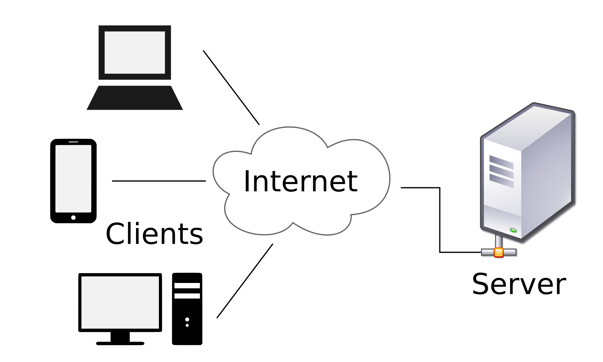
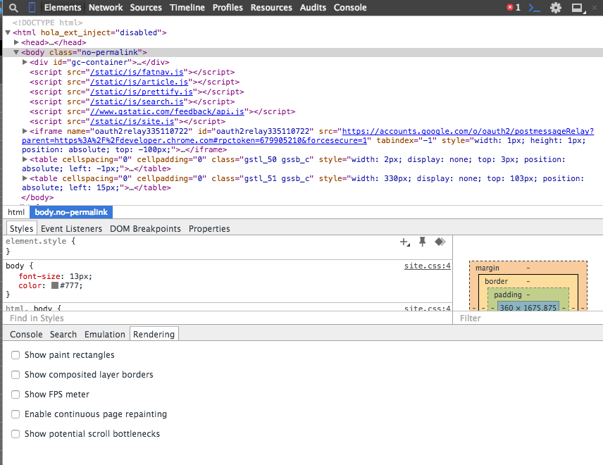
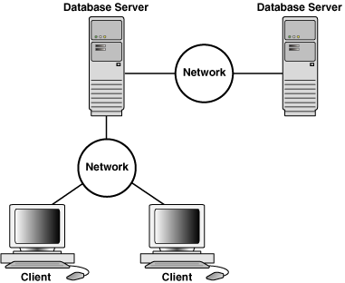

# Product Engineering

As the definition suggests, product engineering is the process of developing a product from the ground up. This implies designing the prototype of the product, researching the market, surveing the potential customers, revising the existing prototype in order to improve it, creating the MVP of the product and testing it in real world environment. After that you have to continue asking your customers for feedback seeking for ways to improve the product, at the same time you test the product, fix the bugs, improve the product, maybe add new features, and make a new release, and so on.

In other words Product Engineering is a generic name for the design and implementation of product life cycle from the idea till you sell it and make a lot of money.

As an objective of this summer camp we settled the following:

"By the end of the summer camp the participants will have the knowledge and competences to run a startup."

Of course two weeks for that is a hell short time, but we'll try to teach you how to think in terms of a product that can be considered a real life IT project. We will go through all the stages of planing, prototyping, designing, implementing and deploying your project.

By now, you have a clear picture of the problem you try to solve and you also have the idea of the solution, is it a news site, or a social network, or a landing page all these have a lot of things in common - they share the same life-cycle.

My coleagues will explain in details how to manage the project, during the next sessions, but before that we have to understang what we have to manage.

Let's see, What are the solutions you want to implement? or let me rephrase, What are your projects?

_[During maximum 10 minutes participants will have to explain what are the projects they have to implement.]_

_[On a flipchart I will write down the names of the projects and the description in bullet points that we'll define during this session, by define I mean list them below the name of the project.]_

_[After we have the descriptions, all together we'll have to find the similarities of the features and we'll discuss them in terms of IT thinking.]_

### The client-server relation

The client model was presented in previous session by Dorin. Now let's go quickly through it again with some examples.

Let's open our browsers and access your favorite site, [www.google.com](www.google.com), this will be your favorite site for the next two weeks! :) 

 

Now, press `Ctrl+Shift+I` or press right click and choose `Inspect Element`.

You'll see the source code of the page, or in other words, you'll see how servers respond to borwsers requests.

Let's try to move to another site and do the same!
[Participants will do so and see that there is the same thing with the source code on all the sites]

If we think of your solutions, what you will have to do is actually implement the server that will know how to respond to requests.

So on the first image, when you've typed `www.google.com` you have made a request to google's server, and the thing you've seen in Inspect Element was it's response to your request.

### Request Response Cycle

So, now if we take a look what happens on the server.

1. The clients talk to the server via network
2. The server communicates the Database that they have to exchange some info(basically making another request-response cycle)
3. Database sends the response to the server
4. The server processes the data, and sends the response to the client.

So as you can see, all the process is pretty simple. Now as we know how things have to work we have to understand what are the main components of your project in order to understand what you'll have to do next.

#### The Client

The __Client__ is any device that has access to the internet and that can access your page. Usually those are browsers.

#### The server

The __Server__  is a computer program that manages access to a centralized resource or service in a network. 

__Note:__ The server can be a client and make requests too.

#### The Database Server

The __DB Server__ is a computer program that provides database services, such as storing, accessing, processing data in a specific format and structure.

We'll discuss that a bit later, but as a matter of a fact these are the main "players" over the internet. Of course this is the very simplistic view, and there exists a lot of variations of this architecture. In case that you'll have questions on what could be a more complex structure, don't hesitate and ask your mentors and they'll tell you a "horror" story about their experience.

_[After the theoretical information was delivered, I together with participants will create a schematic representation of the facebook features: Notifications, groups, messages, friends etc.]_

_[Now, that all the participants have a clear idea what are the main players of WEB apps they wil have to draw a schematic representation of their project. So that they'll define all the types of requests in their schema.]_

### Outcomes

1. Understand what are therequired skills for building WEB projects.

2. Have a clear understanding of their projects from the technical point of view. 

3. Define a list of things that they will have to complete during the summer camp.

4. Create a schema of the project from the architectural point of view.

